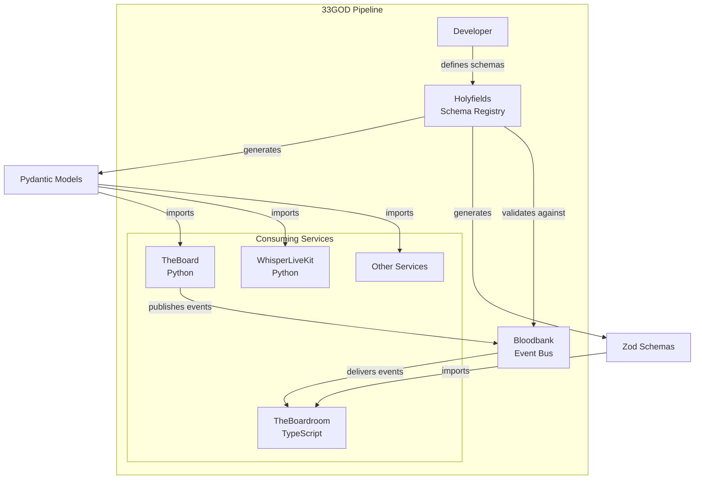

# Holyfields - GOD Document

> **Guaranteed Organizational Document** - Developer-facing reference for Holyfields
>
> **Last Updated**: 2026-02-02
> **Domain**: Infrastructure
> **Status**: Production

---

## Product Overview

**Holyfields** is the **event schema registry and contract system** for the 33GOD ecosystem. It provides a single source of truth for event schemas shared across all microservices, enabling independent component development with guaranteed schema compatibility.

When developing components in parallel (e.g., TheBoard Python backend and TheBoardroom TypeScript frontend), event schema mismatches cause silent failures, missing UI updates, and fake mocked behavior. Holyfields catches these at build time through contract validation.

**Key Capabilities:**
- JSON Schema definitions (Draft 2020-12) as the canonical source of truth
- Automatic Python Pydantic model generation from schemas
- Automatic TypeScript Zod schema generation from schemas
- Contract validation in CI pipeline to prevent schema drift
- Semantic versioning per component for independent evolution

---

## Architecture Position



**Role in Pipeline**: Schema authority that generates type-safe contracts for all components, ensuring event schema compatibility at compile time rather than runtime.

---

## Event Contracts

### Bloodbank Events Emitted

| Event Name | Routing Key | Payload Schema | Trigger Condition |
|------------|-------------|----------------|-------------------|
| `holyfields.schema.updated` | `holyfields.schema.updated` | `SchemaUpdatedPayload` | Schema regeneration completes (CI/manual) |

**Note**: Holyfields primarily generates schemas rather than emitting events. The `holyfields.schema.updated` event is emitted by CI workflows to notify Bloodbank when schemas have been regenerated, allowing runtime schema cache invalidation.

### Bloodbank Events Consumed

| Event Name | Routing Key | Handler | Purpose |
|------------|-------------|---------|---------|
| _None_ | _N/A_ | _N/A_ | Holyfields is a code generator, not a runtime service |

---

## Non-Event Interfaces

### CLI Interface

```bash
# Install dependencies
mise run install

# Generate all language artifacts (Python + TypeScript)
mise run generate:all

# Generate Python Pydantic models only
mise run generate:python

# Generate TypeScript Zod schemas only
mise run generate:typescript

# Validate all JSON schemas
mise run validate:schemas

# Run Python contract tests
mise run test:python

# Run TypeScript contract tests
mise run test:typescript

# Run all tests
mise run test:all

# Run type checking
mise run typecheck

# Full CI validation pipeline
mise run ci
```

**Commands:**

| Command | Description | Example |
|---------|-------------|---------|
| `mise run install` | Install Python and TypeScript dependencies | `mise run install` |
| `mise run generate:all` | Generate Python and TypeScript artifacts | `mise run generate:all` |
| `mise run generate:python` | Generate Pydantic models | `mise run generate:python` |
| `mise run generate:typescript` | Generate Zod schemas | `mise run generate:typescript` |
| `mise run validate:schemas` | Validate JSON Schema syntax | `mise run validate:schemas` |
| `mise run test:python` | Run pytest contract tests | `mise run test:python` |
| `mise run test:typescript` | Run vitest contract tests | `mise run test:typescript` |
| `mise run ci` | Full CI validation | `mise run ci` |

### Schema Directory Interface

**Schema Locations:**

```
holyfields/
├── common/schemas/          # Shared base types and enums
│   ├── base_event.json      # Base event envelope
│   ├── base_voice_event.json # Base for voice events
│   └── types.json           # Common type definitions
├── theboard/events/         # TheBoard meeting events
│   ├── meeting_created.json
│   ├── meeting_started.json
│   ├── round_completed.json
│   ├── comment_extracted.json
│   ├── meeting_converged.json
│   ├── meeting_completed.json
│   └── meeting_failed.json
├── whisperlivekit/events/   # Voice transcription events
│   └── transcription_completed.json
├── schemas/                 # General domain schemas
│   ├── agent/state_changed.json
│   ├── conversation/message_posted.json
│   └── task/
│       ├── step_proposed.json
│       └── step_executed.json
└── generated/               # Auto-generated artifacts
    ├── python/              # Pydantic models
    └── typescript/          # Zod schemas + TS types
```

### API Interface

_No API interface (build-time code generator)_

---

## Technical Deep-Dive

### Technology Stack
- **Language**: Python 3.12+ (primary), TypeScript 5.3+ (generation target)
- **Schema Format**: JSON Schema Draft 2020-12
- **Python Generation**: `datamodel-code-generator` (JSON Schema to Pydantic)
- **TypeScript Generation**: `json-schema-to-zod` (JSON Schema to Zod)
- **Python Validation**: `jsonschema` + `pytest`
- **TypeScript Validation**: `ajv` + `vitest`
- **Task Runner**: `mise` (polyglot task runner)
- **Package Managers**: `uv` (Python), `bun` (TypeScript)

### Architecture Pattern

**Schema-First Contract Development:**

```
                    JSON Schema (Source of Truth)
                              |
        +---------------------+---------------------+
        |                                           |
        v                                           v
   datamodel-code-generator                  json-schema-to-zod
        |                                           |
        v                                           v
   Pydantic Models                           Zod Schemas + TS Types
   (Python Services)                         (TypeScript Services)
        |                                           |
        v                                           v
   pytest validation                         vitest validation
        |                                           |
        +---------------------+---------------------+
                              |
                              v
                    CI Contract Validation
                              |
                              v
                    Bloodbank Event Bus
                    (Runtime Schema Validation)
```

**Key Design Decisions:**

1. **JSON Schema as Single Source**: All types derive from JSON Schema, preventing drift
2. **Generated Code is Committed**: Generated artifacts are tracked in git for visibility and debugging
3. **Dual Language Support**: Python for backends, TypeScript for frontends
4. **Contract Tests**: Ensure generated code matches schema semantics

### Key Implementation Details

**Base Event Schema:**

All events extend `base_event.json` which provides common fields:

```json
{
  "properties": {
    "event_type": {
      "type": "string",
      "description": "Event discriminator (e.g., 'theboard.meeting.created')",
      "pattern": "^[a-z0-9]+\\.[a-z0-9._]+$"
    },
    "timestamp": {
      "type": "string",
      "format": "date-time",
      "description": "ISO 8601 UTC timestamp"
    },
    "meeting_id": {
      "type": "string",
      "format": "uuid",
      "description": "UUID for event correlation"
    }
  },
  "required": ["event_type", "timestamp", "meeting_id"]
}
```

**Python Generation Script** (`scripts/generate_python.sh`):

```bash
datamodel-codegen \
  --input "$SCHEMA_DIR/common/schemas" \
  --input "$SCHEMA_DIR/theboard/events" \
  --input-file-type jsonschema \
  --output "$OUTPUT_DIR" \
  --output-model-type pydantic_v2.BaseModel \
  --field-constraints \
  --use-schema-description \
  --target-python-version 3.12 \
  --validation
```

**TypeScript Generation Script** (`scripts/generate_typescript.sh`):

```bash
bunx json-schema-to-zod \
  --input "$SCHEMA_DIR/theboard/events/meeting_created.json" \
  --output "$OUTPUT_DIR/theboard/events/meeting_created.ts" \
  --name "meetingCreatedEventSchema" \
  --type "MeetingCreatedEvent" \
  --module esm \
  --withJsdocs
```

**Generated Python Model Example:**

```python
from pydantic import BaseModel, Field
from datetime import datetime
from uuid import UUID

class MeetingCreatedEvent(BaseModel):
    """Emitted when a new meeting is created."""
    event_type: str = Field("meeting.created", const=True)
    timestamp: datetime
    meeting_id: UUID
    topic: str = Field(..., min_length=1, max_length=1000)
    strategy: str = Field(..., pattern="^(simple|multi_agent)$")
    max_rounds: int = Field(..., ge=1, le=100)
    agent_count: int | None = None
```

**Generated TypeScript Schema Example:**

```typescript
import { z } from 'zod';

export const meetingCreatedEventSchema = z.object({
  event_type: z.literal("meeting.created"),
  timestamp: z.string().datetime(),
  meeting_id: z.string().uuid(),
  topic: z.string().min(1).max(1000),
  strategy: z.enum(["simple", "multi_agent"]),
  max_rounds: z.number().int().min(1).max(100),
  agent_count: z.number().int().min(1).nullable().optional(),
});

export type MeetingCreatedEvent = z.infer<typeof meetingCreatedEventSchema>;
```

### Data Models

**Event Schema Catalog:**

| Component | Event Type | Description |
|-----------|-----------|-------------|
| **TheBoard** | `meeting.created` | Meeting initialized with topic and config |
| **TheBoard** | `meeting.started` | Meeting transitioned to RUNNING |
| **TheBoard** | `meeting.round_completed` | Single discussion round completed |
| **TheBoard** | `meeting.comment_extracted` | Comment extracted from agent response |
| **TheBoard** | `meeting.converged` | Convergence detected (novelty below threshold) |
| **TheBoard** | `meeting.completed` | Meeting completed successfully |
| **TheBoard** | `meeting.failed` | Meeting execution failed |
| **WhisperLiveKit** | `whisperlivekit.transcription.completed` | Audio transcription completed |
| **General** | `agent.state.changed` | Agent state/thinking updated |
| **General** | `conversation.message.posted` | Message posted in conversation |
| **General** | `task.step.proposed` | Working step proposed |
| **General** | `task.step.executed` | Working step executed and validated |

**Common Types** (`common/schemas/types.json`):

| Type | Format | Description |
|------|--------|-------------|
| `timestamp` | ISO 8601 date-time | Event timestamp |
| `uuid` | RFC 4122 UUID | Unique identifiers |
| `semantic_version` | `\d+\.\d+\.\d+` | Semver version strings |
| `meeting_status` | enum | `created`, `running`, `paused`, `converged`, `completed`, `failed` |
| `agent_name` | string (1-100 chars) | AI agent name |
| `round_number` | integer (min 1) | Meeting round number |
| `novelty_score` | number (0.0-1.0) | Novelty score for convergence |

### Configuration

**Project Configuration** (`pyproject.toml`):

```toml
[project]
name = "holyfields"
version = "0.1.0"
requires-python = ">=3.12"
dependencies = [
    "datamodel-code-generator>=0.25.0",
    "jsonschema>=4.20.0",
    "pydantic>=2.5.0",
]
```

**TypeScript Configuration** (`package.json`):

```json
{
  "name": "holyfields",
  "version": "0.1.0",
  "devDependencies": {
    "ajv": "^8.12.0",
    "json-schema-to-zod": "^2.1.0",
    "typescript": "^5.3.3",
    "vitest": "^1.1.0",
    "zod": "^3.22.4"
  }
}
```

**Task Runner Configuration** (`mise.toml`):

```toml
[tools]
python = "3.12"
node = "20"

[tasks.install]
run = "uv sync && bun install"

[tasks."generate:all"]
depends = ["generate:python", "generate:typescript"]

[tasks.ci]
depends = ["validate:schemas", "generate:all", "typecheck", "test:all"]
```

---

## Development

### Setup
```bash
# Clone Holyfields (as part of 33GOD)
cd /home/delorenj/code/33GOD/holyfields

# Install dependencies
mise run install

# Verify installation
mise run validate:schemas
mise run generate:all
mise run test:all
```

### Running Locally
```bash
# Generate all artifacts
mise run generate:all

# Validate generated code
mise run typecheck

# Run contract tests
mise run test:all
```

### Testing
```bash
# Python tests
mise run test:python
# or: uv run pytest tests/python/

# TypeScript tests
mise run test:typescript
# or: bun test tests/typescript/

# Full CI validation
mise run ci
```

### Adding a New Event Schema

1. **Create JSON Schema** in appropriate directory:
   ```bash
   # For a new component
   mkdir -p schemas/mycomponent/events
   touch schemas/mycomponent/events/my_event.json
   ```

2. **Define schema extending base_event**:
   ```json
   {
     "$schema": "https://json-schema.org/draft/2020-12/schema",
     "$id": "https://33god.dev/schemas/mycomponent/events/my_event.json",
     "title": "My Event",
     "description": "Emitted when something happens",
     "type": "object",
     "allOf": [{ "$ref": "../../common/schemas/base_event.json" }],
     "properties": {
       "event_type": {
         "type": "string",
         "const": "mycomponent.my.event"
       },
       "custom_field": { "type": "string" }
     },
     "required": ["event_type", "timestamp", "meeting_id", "custom_field"]
   }
   ```

3. **Update generation scripts** to include new schema directory

4. **Regenerate artifacts**:
   ```bash
   mise run generate:all
   ```

5. **Add contract tests** in `tests/python/` and `tests/typescript/`

6. **Run validation**:
   ```bash
   mise run ci
   ```

7. **Update this GOD.md** with the new event in the Data Models section

---

## Deployment

**Build-Time Integration:**

Holyfields is not a runtime service. Consuming services integrate Holyfields at build time:

**Python Services** (`pyproject.toml`):
```toml
[tool.hatch.build.targets.wheel]
packages = ["src/holyfields"]

# Import in service code:
# from holyfields.generated.python.theboard.events import MeetingCreatedEvent
```

**TypeScript Services** (`package.json`):
```json
{
  "dependencies": {
    "holyfields": "file:../holyfields"
  }
}

// Import in service code:
// import { meetingCreatedEventSchema } from 'holyfields';
```

**CI Integration:**

```yaml
# .github/workflows/validate-contracts.yml
- name: Validate Schemas
  run: mise run validate:schemas

- name: Generate Artifacts
  run: mise run generate:all

- name: Run Contract Tests
  run: mise run test:all

- name: Type Check
  run: mise run typecheck
```

**System Requirements:**
- Python 3.12+
- Node.js 20+ (for TypeScript generation)
- Bun 1.0+ (for TypeScript package management)
- mise (polyglot task runner)
- uv (Python package manager)

---

## Event Schema Reference

### TheBoard Events

#### `meeting.created`
Emitted when a new meeting is created.

| Field | Type | Required | Description |
|-------|------|----------|-------------|
| `event_type` | `"meeting.created"` | Yes | Event discriminator |
| `timestamp` | ISO 8601 datetime | Yes | Event timestamp |
| `meeting_id` | UUID | Yes | Meeting identifier |
| `topic` | string (1-1000) | Yes | Meeting topic |
| `strategy` | `"simple"` or `"multi_agent"` | Yes | Execution strategy |
| `max_rounds` | integer (1-100) | Yes | Maximum rounds |
| `agent_count` | integer or null | No | Number of agents |

#### `meeting.started`
Emitted when meeting transitions to RUNNING.

| Field | Type | Required | Description |
|-------|------|----------|-------------|
| `event_type` | `"meeting.started"` | Yes | Event discriminator |
| `timestamp` | ISO 8601 datetime | Yes | Event timestamp |
| `meeting_id` | UUID | Yes | Meeting identifier |
| `selected_agents` | string[] | Yes | Agent names |
| `agent_count` | integer | Yes | Agent count |

#### `meeting.round_completed`
Emitted when a discussion round completes.

| Field | Type | Required | Description |
|-------|------|----------|-------------|
| `round_num` | integer (1+) | Yes | Round number |
| `agent_name` | string | Yes | Contributing agent |
| `response_length` | integer | Yes | Response character count |
| `comment_count` | integer | Yes | Extracted comments |
| `avg_novelty` | number (0-1) | Yes | Average novelty score |
| `tokens_used` | integer | Yes | Total tokens consumed |
| `cost` | number | Yes | Cost in USD |

#### `meeting.comment_extracted`
Emitted when a comment is extracted from agent response.

| Field | Type | Required | Description |
|-------|------|----------|-------------|
| `round_num` | integer | Yes | Round number |
| `agent_name` | string | Yes | Comment author |
| `comment_text` | string (1-5000) | Yes | Comment text |
| `category` | enum | Yes | question, concern, idea, observation, recommendation, clarification, other |
| `novelty_score` | number (0-1) | Yes | Novelty score |

#### `meeting.converged`
Emitted when convergence is detected.

| Field | Type | Required | Description |
|-------|------|----------|-------------|
| `round_num` | integer | Yes | Convergence round |
| `avg_novelty` | number (0-1) | Yes | Triggering novelty |
| `novelty_threshold` | number (0-1) | Yes | Threshold used |
| `total_comments` | integer | Yes | Total comments |

#### `meeting.completed`
Emitted when meeting completes successfully.

| Field | Type | Required | Description |
|-------|------|----------|-------------|
| `total_rounds` | integer | Yes | Rounds completed |
| `total_comments` | integer | Yes | Total comments |
| `total_cost` | number | Yes | Total cost (USD) |
| `convergence_detected` | boolean | Yes | Whether converged |
| `stopping_reason` | enum | Yes | convergence, max_rounds, manual |
| `top_comments` | TopComment[] | Yes | Top 5 comments |
| `category_distribution` | object | Yes | Comments by category |
| `agent_participation` | object | Yes | Responses per agent |

#### `meeting.failed`
Emitted when meeting execution fails.

| Field | Type | Required | Description |
|-------|------|----------|-------------|
| `error_type` | enum | Yes | agent_error, timeout, network_error, validation_error, internal_error |
| `error_message` | string (1-2000) | Yes | Error description |
| `round_num` | integer or null | No | Failure round |
| `agent_name` | string or null | No | Failing agent |

### Voice Events

#### `whisperlivekit.transcription.completed`
Emitted when audio transcription completes.

| Field | Type | Required | Description |
|-------|------|----------|-------------|
| `session_id` | UUID | Yes | Voice session ID |
| `source` | string | Yes | Source component |
| `target` | string | Yes | Target consumer |
| `text` | string (1-10000) | Yes | Transcribed text |
| `audio_metadata` | object | Yes | Audio properties |
| `is_final` | boolean | Yes | Final or partial |
| `segment_id` | string or null | No | Segment identifier |

---

## References

- **Domain Doc**: `docs/domains/infrastructure/GOD.md`
- **System Doc**: `docs/GOD.md`
- **Source**: `holyfields/`
- **Generated Python**: `holyfields/generated/python/`
- **Generated TypeScript**: `holyfields/generated/typescript/`
- **JSON Schemas**: `holyfields/schemas/`, `holyfields/theboard/`, `holyfields/common/`
- **Technical Spec**: `holyfields/docs/tech-spec-holyfields-2026-01-14.md`
- **Product Brief**: `holyfields/docs/product-brief-holyfields-2026-01-14.md`
